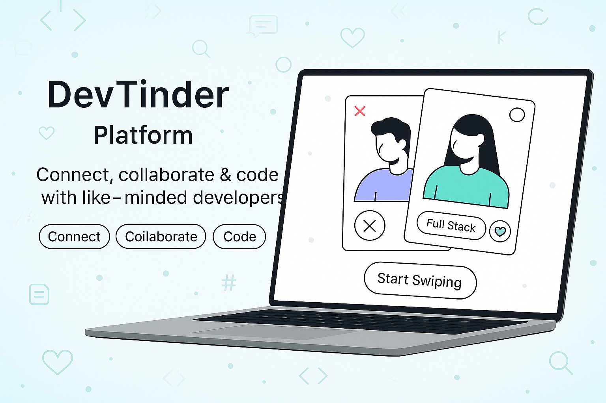
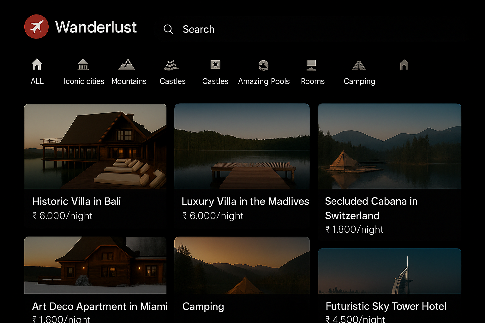
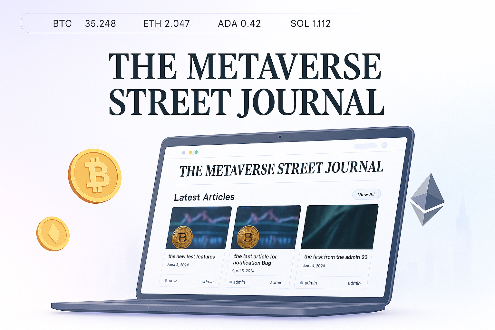

# 🚀 Ankit Kumar – Developer Portfolio

Welcome to my interactive developer portfolio!  
This project showcases my journey as a MERN Stack Developer & DSA Enthusiast, featuring real-world projects, hands-on experience, and a passion for building impactful software.

## ✨ Features

- **Animated Hero Section:** 3D models, animated counters, and a dynamic introduction.
- **Project Showcase:** Highlighting my best work with live demos and GitHub links.
- **Experience Timeline:** Interactive cards detailing my professional journey.
- **Tech Stack:** 3D and static icons for my favorite tools and languages.
- **Contact Form:** Send me a message directly (powered by EmailJS).
- **Responsive Design:** Looks great on any device.
- **GSAP Animations:** Smooth scroll-based and interactive animations throughout.

## 🛠️ Built With

- [React](https://react.dev/)
- [Three.js](https://threejs.org/) & [@react-three/fiber](https://docs.pmnd.rs/react-three-fiber/getting-started/introduction)
- [GSAP](https://gsap.com/)
- [Tailwind CSS](https://tailwindcss.com/)
- [Vite](https://vitejs.dev/)
- [EmailJS](https://www.emailjs.com/)

## 📸 Screenshots





## 🚦 Getting Started

1. **Clone the repo:**
   ```sh
   git clone https://github.com/AnkitKumarHub/Ankit_Portfolio.git
   cd Ankit_Portfolio


Install dependencies:
npm install

Set up environment variables:


Copy .env.example to .env and fill in your EmailJS keys.
Run the development server:
npm run dev

Build for production:
npm run build

🌐 Live Demo
Check out the live portfolio: View Portfolio

🤝 Connect With Me
LinkedIn
GitHub
LeetCode
Email
Crafted with ❤️ by Ankit Kumar.
Let’s build something amazing together!